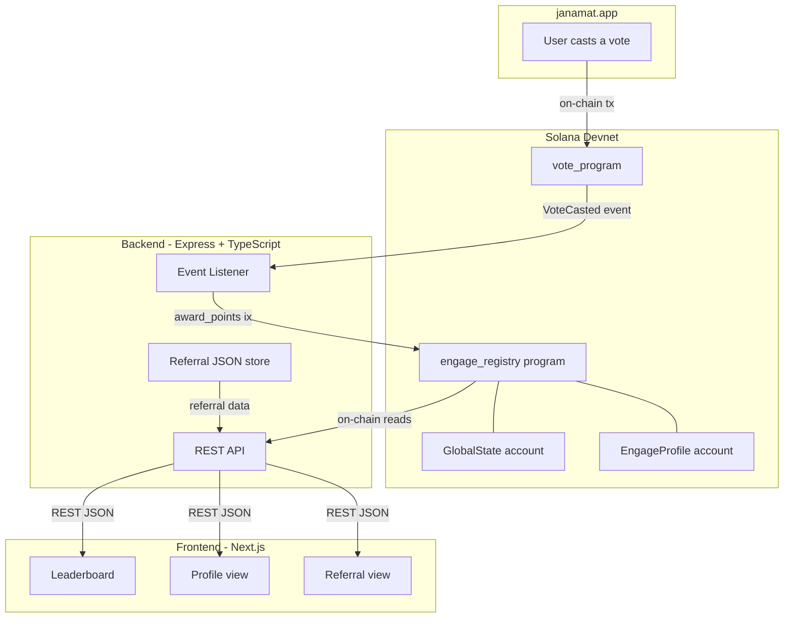

# Janamat Engage Rank

A gamified civic engagement layer on top of [janamat.app](https://janamat.app).
Every vote cast on Janamat earns on-chain points tracked by an Anchor program on Solana devnet.
Points are stored permanently on-chain - no database, fully verifiable by anyone.

Built for the Superteam Earn Mini Hack.

---

## What It Does

- Listens for `VoteCasted` events from janamat.app's vote_program on Solana
- Awards points to voters via the `engage_registry` Anchor program
- Tracks streaks consecutive daily voting earns bonus points (up to +2 per vote)
- Shows a live leaderboard ranked by on-chain points
- Referral system share a link, earn 1 point when the person you referred votes for the first time
- Reward milestones 100 pts for stickers, 200 pts for a Superteam Nepal hoodie, 500 pts for a soulbound NFT

---

## Project Structure

```
janamat-engage-rank/
  backend/              Express API server + Solana event listener
  engage_registry/      Anchor (Rust) program deployed on Solana devnet
  frontend/             Next.js frontend
```

---

## Architecture Overview

At a high level, Janamat Engage Rank sits between `janamat.app`, Solana, and the user-facing leaderboard.



**Key responsibilities:**

- **Solana / `vote_program`**: Emits `VoteCasted` events when users vote on janamat.app.
- **`engage_registry` program**: Owns all on-chain `GlobalState` and `EngageProfile` accounts, enforces streak logic, referral limits, and write permissions.
- **Backend**: Listens to Solana events, translates them into `engage_registry` instructions, exposes a REST API, and maintains referral helper JSON files.
- **Frontend**: Displays the leaderboard, profile and stats views, and referral information using the backend API.

---

## How Points Work

| Action                          | Points earned                   |
| ------------------------------- | ------------------------------- |
| First vote (no streak)          | 1 pt                            |
| Vote on consecutive days        | +1 bonus per streak day, max +2 |
| Max points per vote             | 3 pts (1 base + 2 streak bonus) |
| Referral (referee's first vote) | +1 pt to referrer, max 2/day    |

The 24-hour cooldown is enforced by the Solana program itself no one can bypass it.

---

## On-Chain Program

**Program ID:** `6bY93DBKnAct89SGYhNLwEukNpHm6QQ4zbwANVoWL3X9`  
**Network:** Solana Devnet  
**Framework:** Anchor 0.32

Two accounts are stored on-chain per deployment:

**GlobalState** (one, program-wide)

```
authority            wallet that can award points
total_voters         how many voters have registered
total_votes_recorded total votes processed
```

**EngageProfile** (one per voter wallet)

```
voter                the voter's public key
total_points         cumulative points earned
vote_count           how many votes they've cast
current_streak       current consecutive day streak
longest_streak       their all-time best streak
last_vote_timestamp  unix timestamp of last awarded vote
```

---

## Running Locally

### Prerequisites

- Node.js 24.10+
- Rust + Solana CLI + Anchor CLI (for program changes only)
- A funded Solana devnet wallet at `~/.config/solana/id.json`

### 1. Backend

```bash
cd backend
npm install
cp .env.example .env   # or create .env manually (see below)
npm run dev
```

The backend starts at `http://localhost:4000` and immediately:

- Creates the GlobalState on-chain if it doesn't exist
- Starts listening for VoteCasted events from Solana

**Backend env vars (`backend/.env`):**

```
SOLANA_RPC_URL=https://api.devnet.solana.com
PORT=4000
# Paste keypair JSON from id.json directly
# AUTHORITY_KEYPAIR_JSON="[1,2,3,...]"
# or use a file path:
# AUTHORITY_KEYPAIR_PATH=/path/to/keypair.json  (defaults to ~/.config/solana/id.json)
```

### 2. Frontend

```bash
cd frontend
npm install
cp .env.local.example .env.local   # or create manually
npm run dev
```

Frontend runs at `http://localhost:3000`.

**Frontend env vars (`frontend/.env.local`):**

```
NEXT_PUBLIC_API_URL=http://localhost:4000
ALLOWED_ORIGINS=http://localhost:4000
```

---

## API Endpoints

| Method | Endpoint                  | Description                                 |
| ------ | ------------------------- | ------------------------------------------- |
| GET    | `/leaderboard?limit=20`   | Top voters by on-chain points               |
| GET    | `/stats`                  | Total voters and votes from GlobalState     |
| GET    | `/profile/:address`       | A voter's on-chain profile + referral stats |
| POST   | `/referral/register`      | Record a referee → referrer relationship    |
| GET    | `/referral/stats/:wallet` | Referral stats for a wallet                 |
| GET    | `/referral/by/:wallet`    | Who referred this wallet                    |
| GET    | `/health`                 | Server health check                         |

---

## Referral System

Share your link: `https://janamat.app/signin?ref=YOUR_WALLET_ADDRESS`

When someone signs up via your link and casts their first vote on janamat.app, you earn 1 on-chain point. Maximum 2 referral points per day.

janamat.app calls `POST /referral/register` with the new user's wallet and the referrer's wallet after signin. The point itself fires when the referee votes for the first time.

Referral data is stored in three local JSON files:

- `backend/referrals.json` maps referee → referrer
- `backend/referral_daily.json` daily point counts per referrer
- `backend/referral_awarded.json` which referees have already triggered a point

---

## Redeploying the Program (Fresh Start)

```bash
# 1. Generate a new program keypair
cd engage_registry
solana-keygen new -o target/deploy/engage_registry-keypair.json --force

# 2. Note the new public key printed update it in three files:
#    engage_registry/programs/engage_registry/src/lib.rs  → declare_id!("NEW_ID")
#    engage_registry/Anchor.toml                          → engage_registry = "NEW_ID"
#    backend/src/program.ts                               → ENGAGE_PROGRAM_ID = "NEW_ID"

# 3. Build and deploy
anchor build
anchor deploy --provider.cluster devnet

# 4. Copy the fresh IDL to the backend
cp engage_registry/target/idl/engage_registry.json backend/engage_registry_idl.json

# 5. Clear referral data
cd backend
echo "{}" > referrals.json
rm -f referral_daily.json referral_awarded.json

# 6. Run tests to verify
cd ../engage_registry
anchor test
```

---

## Tech Stack

| Layer          | Tech                                                                                     |
| -------------- | ---------------------------------------------------------------------------------------- |
| Solana program | Rust, Anchor 0.32.1                                                                      |
| Backend        | Node.js 24.10, Express 5.2, TypeScript 5.9, @coral-xyz/anchor 0.32, @solana/web3.js 1.98 |
| Frontend       | Next.js 16.1 (App Router), React 19.2, Tailwind CSS v4                                   |
| Font           | Space Grotesk                                                                            |
| Chain          | Solana Devnet                                                                            |

---

## Future Enhancements

These are ideas that build on the current architecture and would likely come in future iterations:

- **Dedicated indexer / history service**
  - Maintain a full history of votes, point changes, and referrals in an indexer (e.g. a lightweight DB or Solana indexing service).
  - Enable richer analytics (per-poll stats, historical leaderboards, time-series charts, etc.).
  - Make it easier to recompute or audit point totals off-chain if needed.

- **Deeper integration with Janamat APIs**
  - If `janamat.app` exposes APIs for **comments**, **poll outcomes/wins**, and **referrals**, we can cross-verify on-chain events with Janamat’s source-of-truth.
  - Use comments and poll wins to unlock **engagement-based achievements** (e.g. “Top Commenter”, “Prediction Master”, “Debate Champion”).
  - Confirm referrals directly from Janamat’s backend to reduce fraud and reconcile discrepancies between on-chain and off-chain data.

- **Richer gamification**
  - Badge system for streaks, prediction accuracy, and community roles.
  - Seasonal or campaign-based leaderboards (e.g. monthly/quarterly resets with prizes).
  - Teams / communities with shared point pools and team-based rewards.

- **Productization & ecosystem hooks**
  - Public APIs/SDKs so other apps or DAOs can embed the Engage Rank leaderboard or award points for their own actions.
  - Webhooks for downstream integrations (Discord roles, Telegram bots, custom dashboards).
  - Optional support for mainnet or additional Solana clusters if Janamat moves beyond devnet.

---

## Cost & Capacity

The authority wallet (`17.51 SOL` current balance) pays for all write transactions.
Reads (leaderboard, stats, profiles) are always free.

| Action                                   | Cost                                    |
| ---------------------------------------- | --------------------------------------- |
| Creating a voter profile (once per user) | ~0.00142 SOL (rent deposit, refundable) |
| Awarding points per vote                 | ~0.000005 SOL (tx fee)                  |
| Reading leaderboard / stats / profiles   | Free                                    |

**What 17.51 SOL can handle:**

| Scenario                                    | Count                                                     |
| ------------------------------------------- | --------------------------------------------------------- |
| New users (profile creation + first vote)   | ~12,300 users                                             |
| Repeat votes from existing users            | ~3,500,000 votes                                          |
| Combined: 1,000 users each voting 100 times | 1,000 new profiles + 99,000 repeat votes = ~1.93 SOL used |

The rent deposit (~0.00142 SOL per user) is locked in the account, not burned.
It is fully recoverable by calling `close_profile` on any account via the authority wallet.

At 17 SOL, the authority wallet can comfortably onboard ~12,000 new users.
